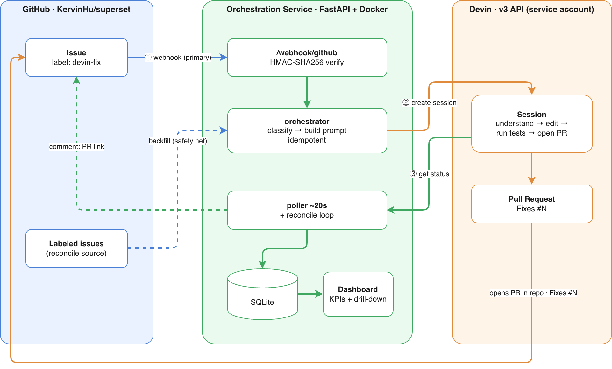
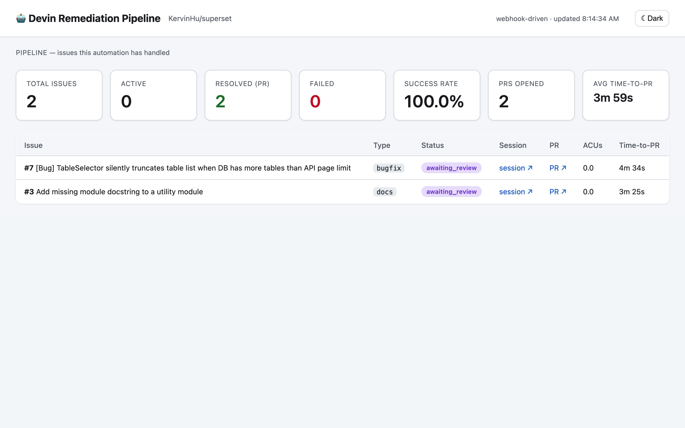
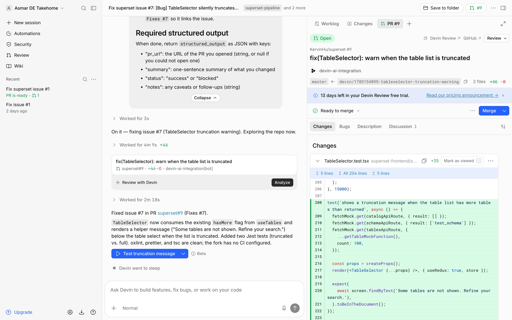
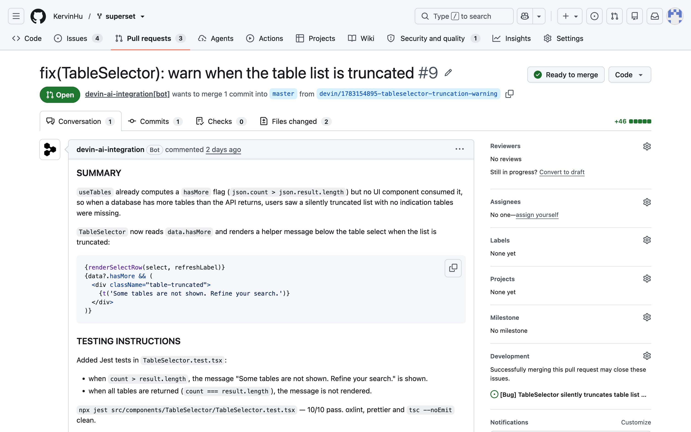
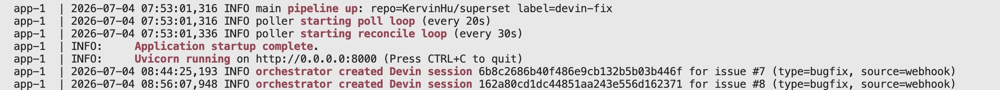

# Devin Superset Remediation Pipeline

An **event-driven** automation that turns labeled GitHub issues into
review-ready pull requests using the [Devin API](https://docs.devin.ai/api-reference/overview).

> Label an issue `devin-fix`, a GitHub webhook fires, and the pipeline starts an
> autonomous Devin session. Devin reads the repo, makes the change, runs
> lint/tests, and opens a PR. Progress is streamed back onto the issue, and a
> live dashboard tracks throughput, success rate, and time-to-PR.

Built against the Apache Superset fork [`KervinHu/superset`](https://github.com/KervinHu/superset).

---

## Why this matters

Dependency bumps, lint debt, and small bug or doc fixes are a constant tax on
engineering teams: individually trivial, collectively expensive, and easy to
deprioritize. This pipeline makes **Devin the primitive** for that class of
work. The "understand, change, validate, open PR" loop runs with no human in
it; everything around Devin does just two jobs: **orchestration** and
**observability**.

## Architecture



**The webhook is the primary trigger; the reconcile loop is a safety net.**
Because webhook deliveries can be dropped, a background loop periodically scans
labeled issues and backfills anything the webhook missed. That safety net is
what makes the pipeline safe to run unattended.

## Configuration

Copy `.env.example` to `.env` and fill it in:

| Var | Description |
|---|---|
| `orgId` | Devin organization id |
| `cogKey` | Devin service-user key (stored with or without `cog_` prefix) |
| `githubToken` | GitHub token with `repo` scope (locally: `gh auth token`) |
| `githubRepo` | `owner/name` of the fork, e.g. `KervinHu/superset` |
| `triggerLabel` | label that triggers remediation (default `devin-fix`) |
| `webhookSecret` | shared secret for webhook HMAC (`openssl rand -hex 24`) |
| `maxAcuLimit` | per-session ACU cost cap (default 10) |
| `pollIntervalSeconds` / `reconcileIntervalSeconds` | loop cadences |

## Run

### With Docker (recommended)

```bash
docker compose up --build          # app on http://localhost:8000
```

Open the dashboard at <http://localhost:8000/dashboard>.

### Locally

```bash
python3 -m venv .venv && ./.venv/bin/pip install -r requirements.txt
./.venv/bin/uvicorn app.main:app --reload
```

## Wire up the webhook (public tunnel)

GitHub's servers must reach your local service, so expose it with a tunnel:

```bash
# 1. start a public tunnel to localhost:8000
cloudflared tunnel --url http://localhost:8000
#    -> prints https://<random>.trycloudflare.com

# 2. register the webhook on the fork (uses gh + the secret in .env)
./scripts/register_webhook.sh https://<random>.trycloudflare.com
```

> Alternatively, `docker compose --profile tunnel up` runs cloudflared as a
> sidecar; read its logs for the URL, then run `register_webhook.sh`.

## Demo the workflow

```bash
# seed the fork with 3 issues (each pre-labeled to trigger the pipeline)
./scripts/demo.sh          # == python scripts/create_issues.py
```

Then watch <http://localhost:8000/dashboard>. Each issue moves
`queued → running → pr_open → awaiting_review → finished`, comments appear on the
GitHub issue, and Devin opens a PR against the fork.

No public tunnel handy? Trigger a specific issue directly:

```bash
curl -X POST http://localhost:8000/simulate/<issue_number>
```

### What it looks like

The dashboard, with live KPI cards and a per-issue table:



A Devin session working the issue:



And the PR Devin opens against the fork:



## Observability

The dashboard and `/stats` endpoint answer the question a lead actually asks:
is this working, and what is it costing?

- `/dashboard` — live (auto-refresh) KPI cards plus a per-issue table with links
  to each Devin session and the resulting PR.
- `/stats` — the same metrics as JSON for scraping or alerting: total, active,
  finished, failed, **success rate**, **PRs opened**, and **average time-to-PR**,
  plus Devin org-level counters (sessions / PRs).
- Cost — Devin meters usage in ACUs, aggregated per billing cycle (PST
  boundary), so the authoritative per-session dollar cost lives in Devin's
  Usage & Limits view. The pipeline reads those figures rather than estimating
  them.
- Structured logs — the backend logs startup, the poll/reconcile loops, and
  each Devin session it creates (with the issue's classified type and trigger
  source). Session-level transitions (PR opened, finished, failed) are mirrored
  onto the GitHub issue as comments.



Success rate is defined as `resolved / (resolved + failed)`, where `resolved`
means Devin opened a PR and finished its part (`awaiting_review` or `finished`)
and `failed` means the session ended with no PR. Issues still in flight are
excluded from the denominator, so active work doesn't distort the rate.

## Extending in a real engagement

- Trigger from a security scanner (Snyk / Dependabot / CodeQL) instead of a manual label.
- Use Devin playbooks to encode repo-specific conventions and raise success rate.
- Fan out across many repos; add per-team ACU budgets and SLOs to the dashboard.
- Gate auto-merge on CI green plus required reviewers.
